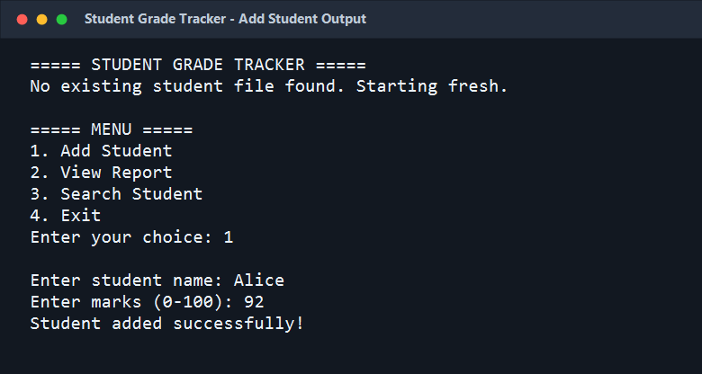
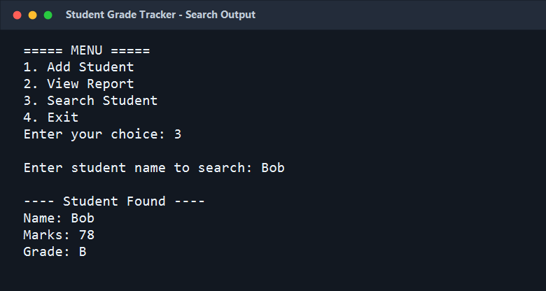
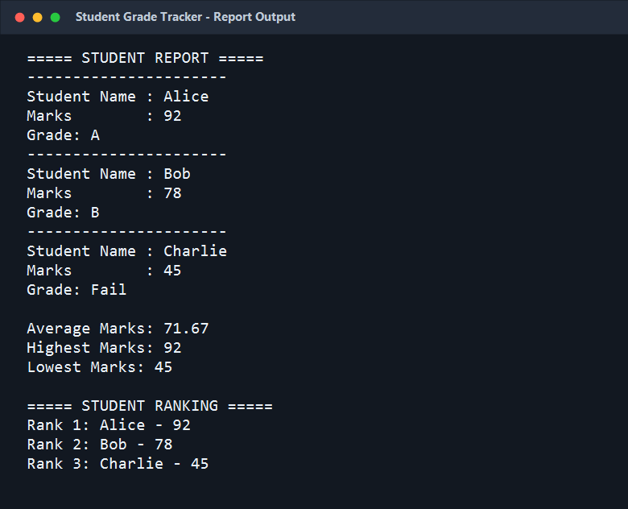

# Student Grade Tracker

Student Grade Tracker is a Java console-based application that helps manage student marks. It allows users to add student records, view a complete grade report, search for a student, calculate average marks, and display rankings based on marks.

## Features

- Add student name and marks
- Validate marks between 0 and 100
- View all student records
- Display grades based on marks
- Calculate average, highest, and lowest marks
- Show student ranking in descending order
- Search student details by name
- Save student records in a text file
- Load existing records when the program starts

## Grade Criteria

| Marks | Grade |
| --- | --- |
| 90 - 100 | A |
| 75 - 89 | B |
| 50 - 74 | C |
| Below 50 | Fail |

## Technologies Used

- Java
- File Handling
- ArrayList
- Scanner

## How to Run

1. Open the project folder in a terminal.
2. Compile the Java file:

```bash
javac StudentGradeTracker.java
```

3. Run the program:

```bash
java StudentGradeTracker
```

## Project Structure

```text
Codealpha_Student_Grade_Tracker.java/
+-- StudentGradeTracker.java
+-- README.md
+-- screenshots/
    +-- output1.png
    +-- output2.png
    +-- output3.png
```

## Output Screenshots

### Add Student Output



### Search Student Output



### Student Report Output



## File Storage

Student records are saved in `students.txt` after adding a student. When the application starts, it automatically loads saved records from this file if it exists.
